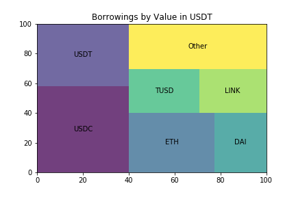

[](http://quantlet.de/)

## [](http://quantlet.de/) **CP2P_AAVEv1** [](http://quantlet.de/)

```yaml

Name of Quantlet: 'CP2P_AAVEv1'

Published in: 'Crypto-Backed Peer-to-Peer Lending'

Description: 'Empirical analysis of on-chain data from Aave v1.'

Keywords: 'CP2P, P2P Lending, Aave'

Author: 'Ramona Merkl'

See also: 'DEDA_2020SS_Crypto_P2P_Lending'

Submitted:  'February 2022'

Datafile: 'The Data is stored in AAVE_V1. Due to the large size, it is uploaded as a .zip file and must be unpacked before usage.'

```




### [IPYNB Code: CP2P_AAVEv1.ipynb](CP2P_AAVEv1.ipynb)


automatically created on 2022-02-17