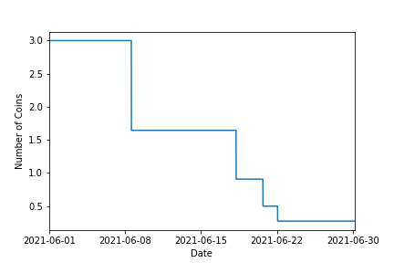
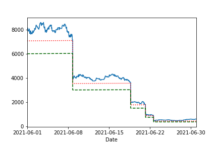
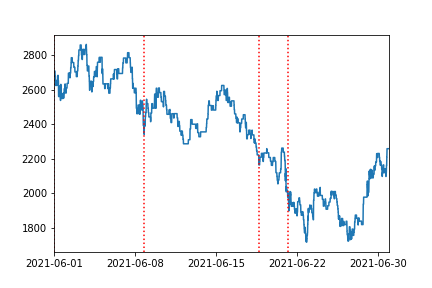
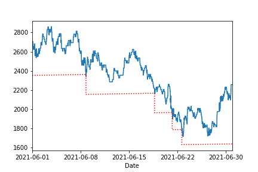

[](http://quantlet.de/)

## [](http://quantlet.de/) **CP2P_coinliqu** [](http://quantlet.de/)

```yaml

Name of Quantlet: 'CP2P_coinliqu'

Published in: 'Crypto-Backed Peer-to-Peer Lending'

Description: 'Illustration of Aave´s coin liquidation mechanism based on a theoretical CP2P contract for June 2021 and historical ETH prices.
It is assumed that the fictional borrower does not take action to avoid liquidations.'

Keywords: 'CP2P, coin liquidation, P2P Lending, Aave v1, collateralized loan'

Author: 'Ramona Merkl'

See also: 'DEDA_2020SS_Crypto_P2P_Lending'

Submitted:  'February 2022'

Datafile: 'price_sub_date.csv'

Input: 'Subset of the Aave v1 price dataset. It involves about 1 year of ETH and other prices.'

```









### [IPYNB Code: CP2P_coinliqu.ipynb](CP2P_coinliqu.ipynb)


automatically created on 2022-02-28