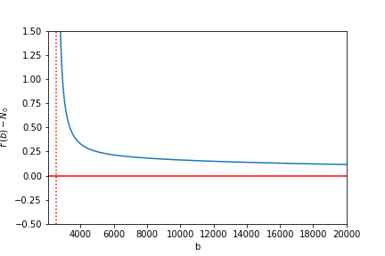
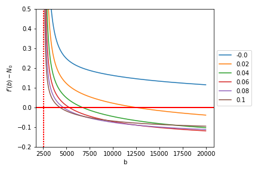

[](http://quantlet.de/)

## [](http://quantlet.de/) **CP2P_smoothfit** [](http://quantlet.de/)

```yaml

Name of Quantlet: 'CP2P_smoothfit'

Published in: 'Crypto-Backed Peer-to-Peer Lending'

Description: 'Solution to the attempt of finding an optimal exercise strategy for a CP2P contract based on Aave´s lending pool mechanism. 
Plotting the function shows, that there is no root and therefore no optimal exercise strategy, if continuous price paths are considered.'

Keywords: 'CP2P, P2P Lending, American Options, Smooth-Fit, Variational Inequalities, HJB'

Author: 'Ramona Merkl'

See also: 'DEDA_2020SS_Crypto_P2P_Lending'

Submitted:  'February 2022'


```





### [IPYNB Code: CP2P_smoothfit.ipynb](CP2P_smoothfit.ipynb)


automatically created on 2022-02-28